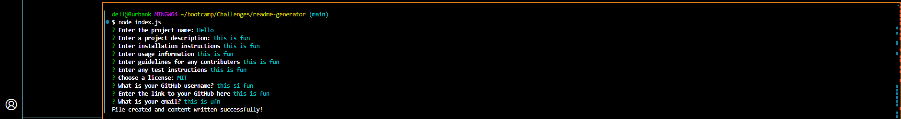

# README-GENERATOR

## Description
This project was created to provide the user with an application that allows them to efficiently create a README.md file for any project by entering information about description, installations, licenses, etc. when prompted. It writes a professional README.md in seconds based on user input and saves the user a large amount of time.

## Table of Contents
- [Installation](#installation)
- [Usage](#usage)
- [Credits](#credits)
- [License](#license)
- [Questions](#questions)

## Installation
To install this project, desired users should access the npm library and install README-GENERATOR package as a developer dependency. Here is the link to the NPM Library: <a href="https://www.npmjs.com">npmjs.com</a>
## Usage
After installing this application, the user should type node index.js to initiate prompts. Prompts will ask the user to input appropriate information and add it to the corresponding section of the README file. Upon completion of prompts, a message stating "File created and content written successfully!" will be logged and a new README file will be generated with entered responses.
An example of what the prompt should look like is as follows: 

## License
This project is licensed under MIT.
MIT License

Copyright (c) [2024] [README-GENERATOR]

Permission is hereby granted, free of charge, to any person obtaining a copy
of this software and associated documentation files (the "Software"), to deal
in the Software without restriction, including without limitation the rights
to use, copy, modify, merge, publish, distribute, sublicense, and/or sell
copies of the Software, and to permit persons to whom the Software is
furnished to do so, subject to the following conditions:

The above copyright notice and this permission notice shall be included in all
copies or substantial portions of the Software.

THE SOFTWARE IS PROVIDED "AS IS", WITHOUT WARRANTY OF ANY KIND, EXPRESS OR
IMPLIED, INCLUDING BUT NOT LIMITED TO THE WARRANTIES OF MERCHANTABILITY,
FITNESS FOR A PARTICULAR PURPOSE AND NONINFRINGEMENT. IN NO EVENT SHALL THE
AUTHORS OR COPYRIGHT HOLDERS BE LIABLE FOR ANY CLAIM, DAMAGES OR OTHER
LIABILITY, WHETHER IN AN ACTION OF CONTRACT, TORT OR OTHERWISE, ARISING FROM,
OUT OF OR IN CONNECTION WITH THE SOFTWARE OR THE USE OR OTHER DEALINGS IN THE
SOFTWARE.

## Questions
For questions, contact kaydenb88@hotmail.com 
My GitHub link is https://github.com/kburbs88